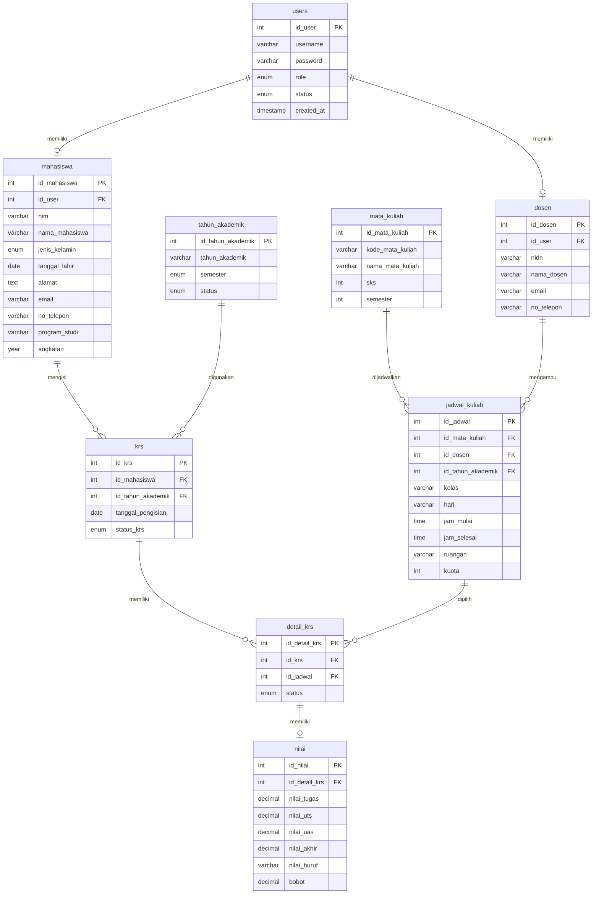

# ERD Sistem Informasi Akademik

```mermaid
erDiagram
    users ||--o| mahasiswa : "memiliki"
    users ||--o| dosen : "memiliki"
    mahasiswa ||--o{ krs : "mengisi"
    tahun_akademik ||--o{ krs : "digunakan"
    krs ||--o{ detail_krs : "memiliki"
    jadwal_kuliah ||--o{ detail_krs : "dipilih"
    mata_kuliah ||--o{ jadwal_kuliah : "dijadwalkan"
    dosen ||--o{ jadwal_kuliah : "mengampu"
    detail_krs ||--o| nilai : "memiliki"

    users {
        int id_user PK
        varchar username
        varchar password
        enum role
        enum status
        timestamp created_at
    }

    mahasiswa {
        int id_mahasiswa PK
        int id_user FK
        varchar nim
        varchar nama_mahasiswa
        enum jenis_kelamin
        date tanggal_lahir
        text alamat
        varchar email
        varchar no_telepon
        varchar program_studi
        year angkatan
    }

    dosen {
        int id_dosen PK
        int id_user FK
        varchar nidn
        varchar nama_dosen
        varchar email
        varchar no_telepon
    }

    mata_kuliah {
        int id_mata_kuliah PK
        varchar kode_mata_kuliah
        varchar nama_mata_kuliah
        int sks
        int semester
    }

    tahun_akademik {
        int id_tahun_akademik PK
        varchar tahun_akademik
        enum semester
        enum status
    }

    jadwal_kuliah {
        int id_jadwal PK
        int id_mata_kuliah FK
        int id_dosen FK
        int id_tahun_akademik FK
        varchar kelas
        varchar hari
        time jam_mulai
        time jam_selesai
        varchar ruangan
        int kuota
    }

    krs {
        int id_krs PK
        int id_mahasiswa FK
        int id_tahun_akademik FK
        date tanggal_pengisian
        enum status_krs
    }

    detail_krs {
        int id_detail_krs PK
        int id_krs FK
        int id_jadwal FK
        enum status
    }

    nilai {
        int id_nilai PK
        int id_detail_krs FK
        decimal nilai_tugas
        decimal nilai_uts
        decimal nilai_uas
        decimal nilai_akhir
        varchar nilai_huruf
        decimal bobot
    }
```
